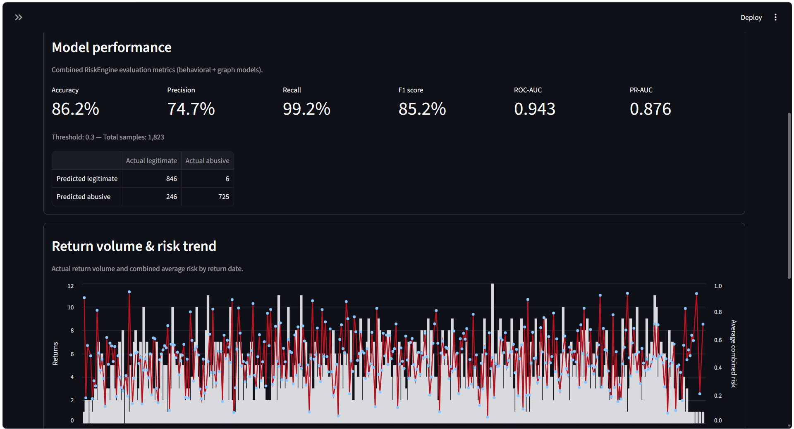

# ReturnGuard



ReturnGuard is a defensive machine-learning system for detecting potentially abusive e-commerce and BFSI returns. It combines customer behavior with relationship signals from a customer/entity graph, then turns both signals into an operational decision with evidence-based explanations.

## What It Does

ReturnGuard uses two independently trained models:

- **Return Risk Model** analyzes transaction and historical customer behavior to estimate `return_risk`.
- **Graph Risk Model** builds a graph from customers and shared devices, IP addresses, shipping addresses, and payment instruments to estimate `network_risk`.

The **Risk Engine** combines both scores:

| Risk level | Recommended action |
| --- | --- |
| `LOW` | `APPROVE` |
| `REVIEW` | `MANUAL_REVIEW` |
| `HIGH` | `HOLD_AND_REVIEW` |

The project also includes a retrieval-augmented generation workflow. Qdrant retrieves relevant evidence, an LLM generates an explanation, Supabase stores structured production data, and Inngest coordinates asynchronous ingestion workflows.

## Architecture

```text
Dataset
	|
	+----------------+
	v                v
Return Model    Graph Model
	|                |
	v                v
return_risk     network_risk
	|                |
	+--------+-------+
				v
		 Risk Engine
				|
				v
		 overall_risk
				|
				v
		  Streamlit
				|
				v
		RAG + Qdrant + LLM
				|
				v
	Evidence-based explanation
```

## Frontend Areas

The Streamlit frontend is organized around three workflows:

1. **Overview**: model performance, business metrics, return volume, and risk trends.
2. **Network**: interactive customer and entity relationship analysis.
3. **Investigation**: select a customer or return, run behavioral and graph inference, inspect the Risk Engine decision, and retrieve an evidence-based explanation.

## Project Structure

```text
Backend/
  main.py                  FastAPI and Inngest RAG service
  data_loader.py           Document loading and embedding helpers
  vector_db.py             Qdrant integration
  risk/
	 return_model.py        Behavioral return-risk model
	 graph_model.py         Customer/entity graph-risk model
	 risk_engine.py         Combined scoring and decision logic
Frontend/
  streamlit_app.py         Streamlit dashboard
  Authentication/          Authentication helpers
dataHub/                   Datasets, transformed features, and artifacts
docs/                      Model and architecture documentation
tests/                     Automated tests
asset/returnGuard.png      Dashboard preview
```

## Requirements

- Python 3.10 or newer
- `uv` for Python dependency management
- Docker for local Qdrant
- Node.js and `npx` for the local Inngest development server
- Service credentials when running with `APP_ENV=PROD`

Install dependencies with:

```bash
uv sync
```

Set `APP_ENV` in `.env` to `LOCAL` or `PROD`. Service settings can be scoped with suffixes such as `QDRANT_URL_LOCAL` and `QDRANT_URL_PROD`; unsuffixed values remain valid fallbacks.

## Run Locally

Start the backend from the `Backend` directory because its application imports are relative to that directory:

```bash
cd Backend
uv run uvicorn main:app --reload --port 8000
```

Start Inngest in a second terminal from the project root:

```bash
npx inngest-cli@latest dev -u "http://127.0.0.1:8000/api/inngest" -no-discovery
```

Start Qdrant in a third terminal from the project root:

```bash
docker run -d --name qdrantDB -p 6333:6333 -v "${PWD}/qdrant_storage:/qdrant/storage" qdrant/qdrant
```

Start the Streamlit frontend in a fourth terminal:

```bash
uv run streamlit run Frontend/streamlit_app.py
```

Default local endpoints:

- Frontend: `http://localhost:8501`
- Backend: `http://127.0.0.1:8000`
- Qdrant: `http://127.0.0.1:6333`

## RAG Workflow

The backend exposes `POST /api/query` for evidence-based answers. Document ingestion is coordinated by Inngest:

1. Load a document from local storage or Supabase Storage.
2. Split and embed the document text.
3. Upsert chunks and source metadata into Qdrant.
4. Retrieve the most relevant chunks for a query.
5. Generate an answer using only the retrieved context.

## Evaluation

Model quality must be reported on a held-out test set. Accuracy alone is insufficient because false positives create unnecessary manual reviews while false negatives can allow abusive returns through.

Track at least:

- Precision and recall
- F1 score
- ROC-AUC and PR-AUC
- Confusion matrix
- False-positive and false-negative counts
- Business cost of false positives and false negatives

Choose thresholds using operational error costs, then validate them on data that was not used for training or threshold selection. Interpret dashboard metrics alongside the held-out split and class balance.

## Tests

Run the test suite with:

```bash
uv run pytest
```

For model-specific details, see [docs/ML_MODEL.md](docs/ML_MODEL.md) and [docs/RISK_ENGINE.md](docs/RISK_ENGINE.md).

## Deployment Notes

- **Render** hosts the backend service.
- **Streamlit** hosts the frontend dashboard.
- **Supabase** provides production structured data and storage.
- **Qdrant** provides vector retrieval for the RAG workflow.
- **Inngest** runs asynchronous ingestion and pipeline functions.
- **Weights & Biases** stores experiment tracking and model artifacts.

Production deployments should use environment-specific credentials and storage paths, load model artifacts from the configured artifact location, and monitor precision, recall, review volume, and false-negative cost after release.

## Further Documentation

- [Run notes](RUN.md)
- [Statistical model](docs/ML_MODEL.md)
- [Risk engine](docs/RISK_ENGINE.md)
- [Repository structure](docs/STRUCTURE.md)
